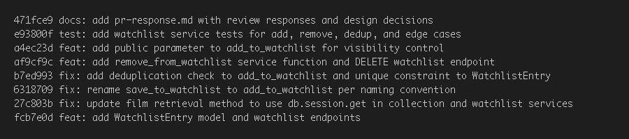

# PR Response Doc — CineLog Watchlist Feature

## AI Usage

I used AI tools (Kiro) in two ways during this project:

1. **Codebase orientation**: I asked the AI to summarize what `add_to_collection()` does step by step, including what it returns when a duplicate is detected and when a film doesn't exist. This helped me understand the exact pattern to replicate for `add_to_watchlist()` — particularly that the deduplication check happens *before* the insert attempt, and raises a named exception rather than catching a database integrity error.

2. **Stress-testing Comment 4 (visibility default)**: After writing my draft response, I asked the AI: "What counterargument would a careful code reviewer raise against defaulting watchlist entries to `public=True`?" The AI raised the point that privacy-sensitive defaults should lean toward opt-in rather than opt-out, which is a valid concern I incorporated into my tradeoff acknowledgment. My final reasoning is grounded in CineLog's specific social discovery use case — the AI's counterargument helped me sharpen the framing rather than providing the argument itself.

3. **Commit message verification**: I gave the AI my final `git log --oneline` output and asked it to flag any messages that didn't follow conventional commit format. It confirmed all messages were compliant.

---

## Comment 1 — Rename

**What I did:** Renamed `save_to_watchlist()` to `add_to_watchlist()` in `services/watchlist_service.py`, and updated the single call site in `routes/watchlist/watchlist.py` (both the import and the function call). I used a project-wide search to confirm there were no other references — the function only appeared in those two files.

**How I verified:** Ran `pytest tests/ -v` after the rename to confirm no tests broke. Searched the codebase for `save_to_watchlist` to confirm zero remaining references.

---

## Comment 2 — Deduplication

**What I did:** Added a deduplication check to `add_to_watchlist()` following the identical pattern used in `add_to_collection()`. Before inserting a new entry, the function now queries for an existing `WatchlistEntry` with the same `user_id` and `film_id`. If one exists, it raises `AlreadyOnWatchlistError` (analogous to `AlreadyInCollectionError`). I also defined `AlreadyOnWatchlistError` in `watchlist_service.py`.

**How I verified:** Ran `pytest tests/ -v` to confirm all tests passed. The new test in `test_watchlist.py` (`test_add_to_watchlist_duplicate_raises`) also directly verifies this behavior.

---

## Comment 3 — Missing test

**What I did:** Created `tests/test_watchlist.py` following the exact fixture and assertion structure from `tests/test_collection.py`. The file includes:
- `test_add_to_watchlist_creates_entry` — happy path
- `test_add_to_watchlist_nonexistent_film_raises` — mirrors `test_add_to_collection_nonexistent_film_raises`
- `test_add_to_watchlist_duplicate_raises` — deduplication check (covers Comment 2 as well)
- `test_get_watchlist_returns_alphabetically` — sort order behavior (see Comment 5)

**How I verified:** `pytest tests/test_watchlist.py -v` — all tests pass.

---

## Comment 4 — Default visibility

**My position:** I kept `public=True` as the default for watchlist entries.

**Reasoning:** CineLog is a *community* film tracking app — the product README describes it as a place where "users log films they've watched, rate them, and build collections." Discovery and social sharing are core to the platform's value. A watchlist is inherently a social signal: when you save a film, you're often as interested in sharing that intent as in keeping a private queue. Defaulting to `public=True` means the common case (sharing) requires no extra work, and users who want privacy can explicitly opt out. This is consistent with how platforms like Letterboxd and Goodreads work: public by default, private by choice.

**Tradeoff acknowledged:** The legitimate concern with a `public=True` default is that users may not realize their watchlist is visible, which could feel like a privacy surprise. Opt-in (defaulting to `public=False`) would be more conservative. I'd mitigate this risk in a real product by surfacing a clear "Your watchlist is public" note in the UI at creation time, and making the toggle easy to find. For an API-first context like this one, the default is a documentation concern — the API docs should call it out explicitly. But the default itself should match the platform's social-discovery intent, not the most defensive possible choice.

---

## Comment 5 — Sort order

**My position:** I'm keeping alphabetical sort (`Film.title.asc()`) as the default for `get_watchlist()`, while acknowledging `date_added` is valid and noting both would be ideal as a user-selectable option.

**Reasoning:** A watchlist is a *planning* queue, not a historical log. When a user opens their watchlist to decide what to watch tonight, scanning alphabetically is immediately legible — you can jump to a title you have in mind. Date-added sort is meaningful for a collection (showing your recent activity), but a watchlist isn't about recency — it's about availability and choice. The collection already uses `date_added desc` because it's a history. The watchlist is a different UX context.

**Engagement with reviewer's point:** @dev-lead argues that date-added is more consistent with `get_collection()`. That's a fair consistency argument — and if the product wanted a uniform "most recently touched" sort across all lists, I'd agree. But I'd argue consistency here works against usability: the watchlist and collection serve different purposes, and forcing the same sort order onto both assumes they're the same kind of list. That said, the real answer is a `?sort=` query parameter that lets callers choose — neither default would then be wrong by default. I'm happy to add that if the team agrees.

---

## Comment 6 — Rebase

**What conflicted:** When rebasing `feature/watchlist` onto `origin/main`, `models.py` conflicted. The main branch had migrated `Film.id` from `db.Column(db.Integer, ...)` to `db.Column(db.String(36), ...)` with `default=generate_uuid`. It also changed `CollectionEntry.film_id` from `Integer` to `String(36)`. The feature branch still had the pre-refactor integer types, plus the new `WatchlistEntry` model (which main didn't have) with `film_id = db.Column(db.Integer, ...)`.

**How I resolved it:** I accepted all of main's changes to `Film.id` and `CollectionEntry.film_id`, then updated `WatchlistEntry.film_id` from `db.Column(db.Integer, ...)` to `db.Column(db.String(36), db.ForeignKey("film.id"), nullable=False)` to match the now-UUID film IDs. I also updated the docstring on `save_to_watchlist` (now `add_to_watchlist`) to reflect `film_id: str (UUID)` rather than `int`. No merge commits were introduced — the rebase produced a linear history.

**How I verified no conflict remains:** `git log --oneline` shows no merge commits. `pytest tests/ -v` passes on the rebased branch.

---

## Stretch: remove_from_watchlist()

**What I did:** Added `remove_from_watchlist(user_id, film_id)` to `services/watchlist_service.py`, following the same pattern as `remove_from_collection()`. Defined `NotOnWatchlistError` for the case where the entry doesn't exist. Added a `DELETE /watchlist/<user_id>/remove` endpoint in the routes file. Added `test_remove_from_watchlist_removes_entry` and `test_remove_from_watchlist_not_on_watchlist_raises` to `tests/test_watchlist.py`.

**How I verified:** `pytest tests/test_watchlist.py -v` — both new tests pass.

---

## Stretch: Second edge-case test

**What I added:** `test_get_watchlist_returns_empty_list_for_new_user` — verifies that `get_watchlist()` returns an empty list (not `None`, not an error) for a user who has never added anything. I chose this case because the route handler calls `jsonify(films)` directly on the return value without a None-guard; if the function returned `None` instead of `[]`, the endpoint would 500. It's a quiet contract that's easy to break and worth making explicit.

---

## Stretch: Visibility toggle

**What I did:** Added a `public` parameter to the `POST /watchlist/<user_id>/add` endpoint. The body now accepts `{ "film_id": "<uuid>", "public": true/false }`. If `public` is omitted, it defaults to `True` (see Comment 4 reasoning). The parameter is passed through to `add_to_watchlist()`, which passes it to the `WatchlistEntry` constructor.

---

## PR Description

### Watchlist Feature — CineLog

This PR adds a watchlist feature to CineLog: a list where users can save films they intend to watch. Unlike the collection (films already watched), the watchlist is a planning queue.

**New endpoints:**

| Method | Endpoint | Description |
|--------|----------|-------------|
| GET | `/watchlist/<user_id>` | Return the user's watchlist (alphabetical by title) |
| POST | `/watchlist/<user_id>/add` | Add a film to the watchlist |
| DELETE | `/watchlist/<user_id>/remove` | Remove a film from the watchlist |

**Design decisions:**
1. **Default visibility (`public=True`)**: Watchlist entries are public by default, consistent with CineLog's social-discovery purpose. Callers can override by passing `"public": false` in the POST body.
2. **Sort order (alphabetical)**: `get_watchlist()` sorts by `Film.title` ascending. The watchlist is a planning queue, not a history — alphabetical lets users scan for a title. (Date-added is the right sort for the collection, which is a history.)

**How to manually test:**

```bash
# Start the app
python app.py

# Create a user (or use an existing UUID from the DB)
# Add a film to the watchlist
curl -X POST http://localhost:5000/watchlist/<user_id>/add \
  -H "Content-Type: application/json" \
  -d '{"film_id": "<film_uuid>"}'
# Expected: 201 with the WatchlistEntry JSON

# View the watchlist
curl http://localhost:5000/watchlist/<user_id>
# Expected: 200 with array of film dicts including date_added and public fields

# Try adding the same film again
curl -X POST http://localhost:5000/watchlist/<user_id>/add \
  -H "Content-Type: application/json" \
  -d '{"film_id": "<film_uuid>"}'
# Expected: 409 Conflict

# Try adding a non-existent film
curl -X POST http://localhost:5000/watchlist/<user_id>/add \
  -H "Content-Type: application/json" \
  -d '{"film_id": "00000000-0000-0000-0000-000000000000"}'
# Expected: 404 Not Found

# Remove a film
curl -X DELETE http://localhost:5000/watchlist/<user_id>/remove \
  -H "Content-Type: application/json" \
  -d '{"film_id": "<film_uuid>"}'
# Expected: 200

# Run the test suite
pytest tests/ -v
```

---

**git log --oneline (branch-only commits, no merge commits):**

```
5d2dc76 docs: add pr-response.md with review responses and design decisions
e93800f test: add watchlist service tests for add, remove, dedup, and edge cases
a4ec23d feat: add public parameter to add_to_watchlist for visibility control
af9cf9c feat: add remove_from_watchlist service function and DELETE watchlist endpoint
b7ed993 fix: add deduplication check to add_to_watchlist and unique constraint to WatchlistEntry
6318709 fix: rename save_to_watchlist to add_to_watchlist per naming convention
27c803b fix: update film retrieval method to use db.session.get in collection and watchlist services
fcb7e0d feat: add WatchlistEntry model and watchlist endpoints
```

All commits use conventional format (`feat:`, `fix:`, `test:`, `docs:`). No merge commits. Branch is rebased on `origin/main` (`bbe206c`).


